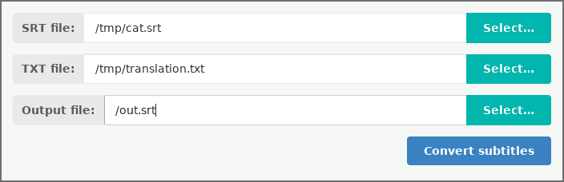

# Replace Subtitles

Simple application to replace text in subtitles files with another. Utility will replace subtitles line by line.



## Example

| # |  Original Subtitles (source file)     | Translation Text (line to line translation) | Translated Subtitles (created with this application) |
|---| --------------------------------------|---------------------------------------------|------------------------------------------------------|
| 1 | 1                                     | Cat, how do you manage to sleep so much?    | 1                                                    |
| 2 | 00:00:08,640 --> 00:00:12,080         | I get extremely tired, sleep is hard work.  | 00:00:08,640 --> 00:00:12,080                        |
| 3 | Кот, как тебе удается столько спать?  |                                             | Cat, how do you manage to sleep so much              |
| 4 |                                       |                                             |                                                      |
| 5 | 2                                     |                                             | 2                                                    |
| 6 | 00:00:12,940 --> 00:00:16,620         |                                             | 00:00:12,940 --> 00:00:16,620                        |
| 7 | Я сильно устаю, сон - тяжелая работа. |                                             | I get extremely tired, sleep is hard work            |

## Build

To build application from source code use following command:

```sh
cargo build --release
```

To start `replace-subtitles` use following command:

```sh
./target/release/replace-subtitles
```

## License
[license]: #license

Source code is primarily distributed under the terms of the MIT license. See LICENSE for details.
